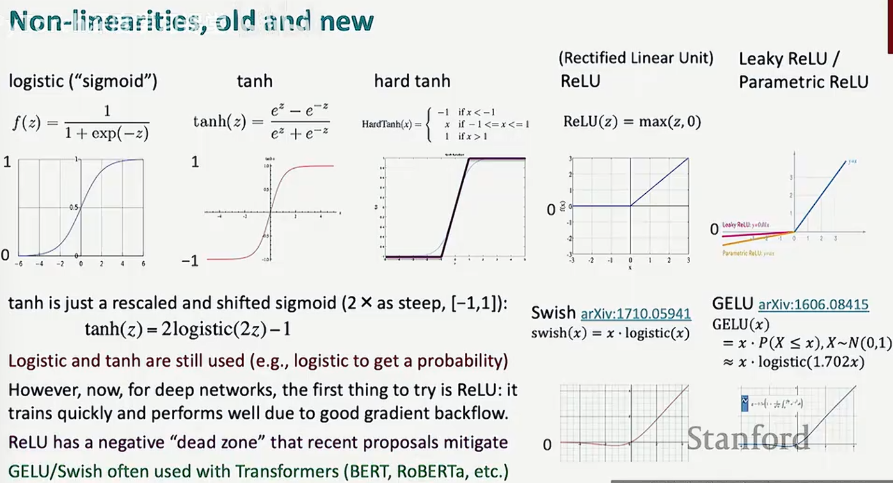
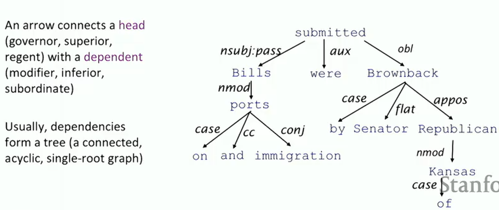
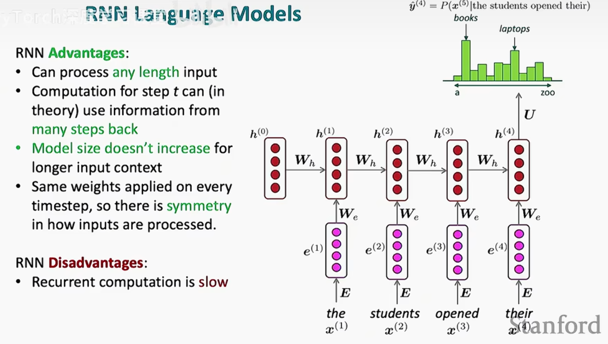
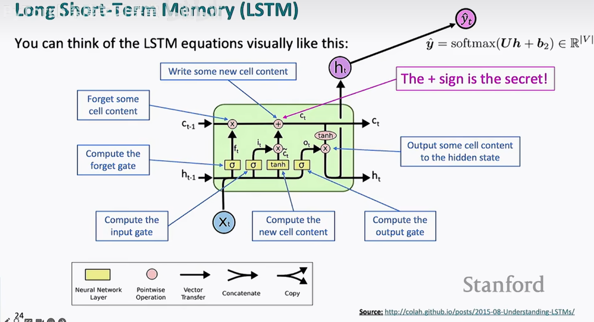
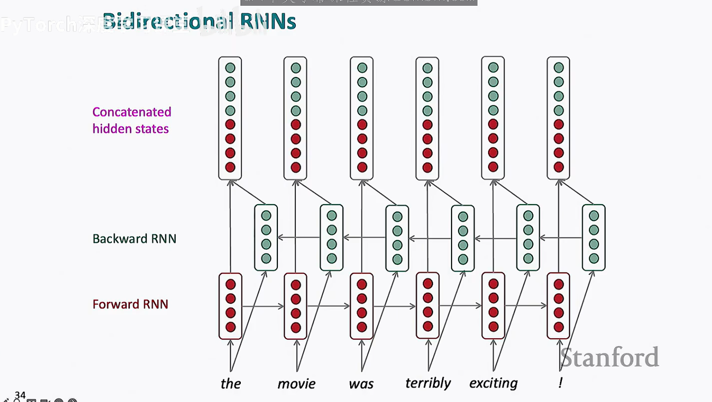
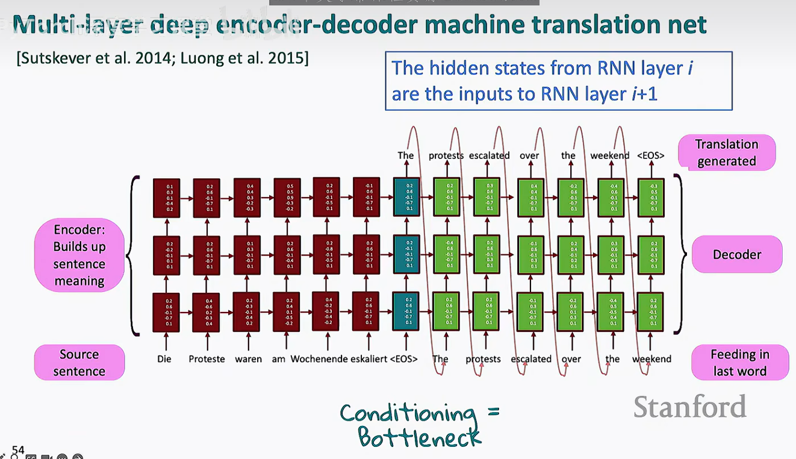

这门课作为cs338的先修课，我预计使用10小时学完，所以就不进行详细的分级了

关于python和pytorch基础，[请移步](pybasis.md)

**主要的思想**：梯度，优化，pytorch，词向量，前馈神经网络，循环网络

1. 独热向量（one-hot vectors）：词向量组只包含一个1元素，可以用点积直接反映出在莫格维度上的相关度情况

## word2vec 
从大量文本开始，实现文本的向量化1，其中的本质就是在固定的context窗口（大小为m）进行遍历，使得当前词出现时周边词的条件概率最高，即：

$$
Likelihood = L(\theta) = \prod_{t=1}^{T}\prod_{-m\le j\le m (j \neq 0)} P(w_{t+j}|w_t;\theta)
$$
但是又两个问题
1.不符合下降的原则
2.连乘很容易导致数据爆炸

所以优化成
$$
J(\theta)=-\frac{1}{T} \log L(\theta)=-\frac{1}{T} \sum_{t=1}^{T} \sum_{\substack{m \leq j \leq m \\ j \neq 0}} \log P\left(w_{t+j} \mid w_{t} ; \theta\right)
$$
1. 增加了负号
2. 用了取对的方式

有点像CNN也是用窗口去进行计算
```text
    G老师给了我证明
你觉得像，主要是因为这几点“表面结构一致”：
（1）都有参数矩阵
Word2Vec：embedding matrix（𝑉,𝑈）
CNN：卷积核（filters）
✔ 都是在学“特征表示”
（2）都有“局部窗口”
Word2Vec：context window（±m）
CNN：receptive field（卷积窗口）
✔ 都是在利用“局部信息”
（3）都用梯度下降优化
都在最小化 loss
都在反向传播更新参数
不同点：
4. 本质区别（重点）
（1）有没有“空间结构”
CNN：
输入是有结构的（图像）
卷积利用空间局部性 + 平移不变性
Word2Vec：
输入是离散 token（one-hot）
没有空间结构
“窗口”只是人为定义的上下文
👉 本质不同：
CNN 是 结构建模，Word2Vec 是 统计共现建模
（2）计算方式
CNN：
y=W∗x（卷积）
Word2Vec：
score=u·v（点积）
👉 一个是局部加权求和（卷积）
👉 一个是向量相似度（内积）
（3）目标函数
CNN（分类）：
P(y∣x)
Word2Vec：
P(context word∣center word)
👉 Word2Vec 本质是：
语言模型的简化版（只看局部条件概率）
```
所以我们现在的概率这样计算
$$
P(o|c) = \frac{exp(u_0^T v_c)}{\sum_{W \in V}exp(u_0^T v_c)}
$$
也就是大名鼎鼎的softmax：
$$
softmax(x_i)=\frac{exp(x_i)}{\sum_{j=1}^n exp(x_i)} = p_i 
$$

然后，只要对这个函数取关于w的偏导，就能成功的从原来的函数中提取出关于w下降或上升的趋势，接着就是机器学习的任务了

不同的取样模型？
词袋（word-bag）模型：选取所有上下文出现过的词然后做词向量乘法
跳字（skip-words）模型：就是上面的词框技术
负采样（negative sampling）:用少量随机负样本，把原本的全词表预测问题转化为二分类任务，从而高效学习词向量。

### 词向量在word2vec的一般构建方法
1. 首先是对在文章中的词进行遍历，取出最小重复组
2. 然后对最小重复组进行遍历，确定窗口大小，然后有在窗口内的就加相关值
3. 得到的矩阵进行数据优化，一般采用GLOVE（全局向量法）而不是SVD（特征值分解）
    tips：SVD和GLOVE的区别，一个是降维结构提取，另一个是机器学习模型
    $$
    J=\sum_{i,j}f(X_ij​)(w_i^T ​w_j​+b_i​+b_j​−logX_ij​)^2
    $$
    通过学习词向量S.T.
    $$
    w^T_i w_j \approx log X_ij
    $$
    从而优化出一个最小损失函数，并且可以通过训练来优化
4. 接着就是通过对所得到的向量组进行分析了（作图，判断向量关系……）

最后，为什么我们需要向量化？
因为向量化让原来复杂的关系直接变成了可以通过加减乘除解决的数据集，这在算法上是重大的优化，加快了在CPU GPU上的处理速度

### classifier
分类器在NPL中扮演着相当重要的作用像NER（Named Entity Recognition）
分类器存在的意义就是为了解决相关的问题，来保证一词多义的词能找到归属
通过读取上下文，读取当前的语义环境，来实现更有效的开发

#### 神经分类器
这是基于transformer等神经网路的另一种分类方式，他们往往具有非线性的分类方式，能够处理更复杂的情况。

### 交叉熵损失（cross entropy loss）
$$
H(p,q) = \sum^C_{c=1}p(c)log q(c)
$$
从条件P到Q的信息损失

## 神经网络

1. 非线性函数的选择
几种拟合



2. 梯度下降
在这里我们和其他的·机器学习一样，同样都是做反向传播，梯度计算
但是有一点不同，就是这里的函数都要使用jacobian矩阵引申出来的形状约定

正如第一张图片所言，如果使用 $1 \times nm$ 的 Jacobian 矩阵，做梯度下降更新 $\theta^{new} = \theta^{old} - \alpha \nabla J(\theta)$ 时会非常“Inconvenient”（不方便）。保持形状一致，意味着可以直接在内存中对矩阵进行元素级的减法运算。空间效率：Jacobian 矩阵往往包含大量零元素（稀疏），直接按原形状存储梯度可以节省大量的内存开销。

3. 反向传播
反向传播总共就两个过程
    1. 微积分 - 在计算梯度/返回的时候我们能知道怎么回去
    2. 储存变量 - 我们不必要算之前的过程，可以直接调用
于是我们就得到了梯度计算的返回值
这个时候将梯度相加，然后再进行相关的学习率优化，我们就能得到最后的结果

## 语言学（笑死了怎么突然这么有文化）
```text
人们创造性地使用语言
```
### 乔姆斯基层级 (Chomsky Hierarchy) 与 正则表达式 概览

| 层级 | 文法类型 | 语言类别 | 识别自动机 (辨识器) | 正则表达式 (Regex) 的关联 | 典型应用场景 |
| :--- | :--- | :--- | :--- | :--- | :--- |
| **Type 3** | **正规文法 (Regular)** | 正则语言 | **有限状态自动机 (DFA/NFA)** | **核心定义域**。标准的正则操作（连接、选择、闭包）完全属于此层级。 | 词法分析、匹配固定模式（如电话、邮箱）。 |
| **Type 2** | **上下文无关 (Context-Free)** | 上下文无关语言 | **下推自动机 (PDA)** | **超越边界**。纯正则无法处理嵌套（如平衡括号），但现代正则引擎通过“递归”支持了部分此特性。 | 编程语言语法、HTML/XML 标签配对解析。 |
| **Type 1** | **上下文有关 (Context-Sensitive)** | 上下文有关语言 | **线性有界自动机 (LBA)** | **高级特性**。正则中的“反向引用”（Backreferences）在数学上使其跨越到了此层级。 | 自然语言处理、复杂的依赖检查。 |
| **Type 0** | **无限制 (Unrestricted)** | 递归可枚举语言 | **图灵机 (Turing Machine)** | **逻辑极限**。任何可计算的问题，理论上正则引擎如果不加限制地运行脚本（如 PCRE 的某些扩展），可模拟图灵机。 | 任意算法逻辑、通用计算机程序。 |

---

#### 关键点总结：
1. **嵌套关系**：Type 3 $\subset$ Type 2 $\subset$ Type 1 $\subset$ Type 0。
2. **正则的本质**：在纯数学中，正则表达式只能描述 **Type 3** 语言（无记忆、无嵌套）。
3. **现代工具的“越级”**：我们平时在 Python、Java 或 PHP 中使用的 Regex 引擎（如 PCRE），由于引入了 **捕获组反向引用** 和 **递归匹配**，其实际表达能力已经达到了 **Type 1** 甚至更高，这超出了“正规文法”的原始范畴。
句法结构：
1. 短句结构
2. 正常语法

词的结构
词 - 词组（单元） - 句子

句的结构
依存结构（dependencies） - 依存结构的重心往往聚焦于某一个词（中心词），其他都是修饰部分
句子职位一个词服务，其他的词块也只为了一个中心词服务


### 依存语法
依存句法通过建立词与词之间的二元非对称关系（binary asymmetric relations）来描述句子的结构。

提取语义关联：识别出核心的谓词-论元结构（predicate-argument structure），明确谁是中心词（head），谁是修饰语（dependent）。

处理长距离依赖 (Long-distance dependency)：相比于邻近词，它能跨越无关词汇直接连接具有语义关联的词（如图片中 discussion 与 was completed 的连接）。

句法特征：

双词亲和力 (Bilexical affinities)：判断两个词组合在一起是否合理（如“讨论”与“问题”的搭配）。

依赖距离 (Dependency distance)：捕捉近距离依赖为主、远距离为辅的分布规律。

介于中间的材料 (Intervening material)：识别标点或动词对依赖关系的阻断作用。

中心词的价态 (Valency of heads)：确定一个中心词通常左右各有多少个依赖词。

下游应用支撑：为信息抽取（Information Extraction）、机器翻译（Machine Translation）和语义分析（Semantic Analysis）提供精炼的骨干结构，去除虚词干扰。

### 贪心算法

贪心算法就是让每一步都符合当下利益最大化，这种处理方式可能在某些情况能解出局部最优解，但是由于缺少全局视野，往往在长上下文的情况下会发生问题

#### 基于转移的句法分析 (Transition-based Parsing)
##### Arc-standard 算法
通过一个栈 (Stack) 和一个缓存队列 (Buffer) 的互动，像拼拼图一样构建出句子的依存结构。
Arc-standard 算法操作详解该算法通过三种核心操作（Transitions）来处理句子：
移进 (Shift)，左弧 (Left-Arc, LA)，右弧 (Right-Arc, RA)
这个算法的精妙之处在于它将复杂的树状结构构建转换成了序列化的动作决策。在现代 NLP 中，我们会训练一个分类器（通常是神经网络）来预测每一步该执行 Shift、LA 还是 RA。
这样，我们就能通过及前期学习的方法在n步中得到一个n长度的输入的结构

#### 当然，这种解析器也存在着问题，正像贪心算法中说的，我们往往会困于局部解而没办法直接进行全局的判断
所以我们需要迭代

引入全局搜索与强化 (如 Andor et al. 2016)
类别：带全局优化的基于转移模型。
特点：谷歌的研究者通过全局缩放（Global normalization）和束搜索（Beam Search）来缓解局部决策的盲目性。
效果：准确率大幅提升，达到了 94% 左右的 UAS。

基于图的神经网络模型 (如 Dozat & Manning 2017)
类别：基于图 (Graph-based)。
核心逻辑：双仿射评分 (Biaffine scoring)：不再一步步转移，而是直接计算句子中任意两个词 $i$ 和 $j$ 之间存在依存关系的概率。
全局最优：在所有的得分矩阵中寻找最大生成树（Maximum Spanning Tree）。
优势：准确率登顶。它考虑了全句的信息，不存在错误累积问题。
代价：计算复杂度变为 $O(n^2)$（因为要计算每两个词之间的关系得分），在长句解析上比基于转移的方法慢。

## 语言模型

### 正则化（regularization）
一个随机的损失函数
$$
J(\theta) = \frac{1}{N}-log(\frac{e^{f_{y_i}}}{\sum_{c=1}^C e^{f_c}}) + \lambda\sum_k \theta^2_k
$$
最后的那一项就是我们需要的正则化参数
为什么我们需要正则化函数？为了防止过拟和，导致在面对新数据的时候发生问题

### 随机失活（dropout）
竟然是顾名思义，就是用掩码（mask）遮盖相关的信息，来使我们的函数输入发生变化

### 优化器（optimizer）
集成了梯度下降等基本原理的工具，用于在最后求出我们的最优解

最经典的比如说像Adam优化器，结合了动量法和RMSprop的优点，计算一阶和二阶动量的指数加权平均，并进行偏差修正。其公式为：
m_t = β1 * m_(t-1) + (1 - β1) * ∇θJ(θ)
v_t = β2 * v_(t-1) + (1 - β2) * (∇θJ(θ))^2
m_t_hat = m_t / (1 - β1^t)
v_t_hat = v_t / (1 - β2^t)
θ = θ - η * m_t_hat / (√v_t_hat + ε)
Adam具有快速收敛和鲁棒性强的特点，是深度学习中最常用的优化器之一。

## 神经语言模型

语言模型的本质就是可以预测下一个词
本质上就是贝叶斯公式，分析造成结果的各种原因中权重最大的那个

### 固定窗口神经语言模型

固定窗口的优点是没有稀疏性问题
而且具有平移不变性
但是问题也很明显
就是上下文太小了，同时我们的时间复杂度是O(n^2)

### RNN（循环神经网络）


循环神经网络就是通过用一个权重矩阵w来遍历，每次走完一层，我们用优化器更新一下w
但是问题也依然存在
1. 这种更新方式让新输入的向量占了隐藏层主导，这会使得上下文的能力很差
2. 时间复杂度还是O(n^2)

Loss怎么计算？
Loss的计算往往在训练阶段，我们在训练的时候将生成的词向量和最终的词向量做对比，然后我们算出其中的向量差，经过Jacobian矩阵最后得到我们需要的东西

### LSTMs(长短期记忆网络)

#### Loss的传播
当loss很小时，loss会在传播中越来越小，知道小时，这一种状况叫做`梯度消失`

梯度的小时将导致一些特征在传播中消失，这将导致长文本处理出现问题

同时，当梯度很大时，我们在返回的过程中将发生梯度爆炸，梯度爆炸将会导致我们的隐藏层失真

所以，为了防止这种情况发生，人们选择裁剪梯度，当梯度太大的时候直接在所有维度上缩小


所以我们发现，无论怎么处理返回关系，我们的loss总是不能很好的传播，不管是长度还是信息

所以我们引出了**LSTMs(LongShort-Term Mermory RNNs)**
LSTMs的主要创新就是引入了单元层和隐藏层

而我们使用门控来判断信息进入那个层
forget gate, input gate, output gate


遗忘门 (Forget Gate, $f_t$)：通过 $\sigma$（Sigmoid 层）决定上一个时刻的记忆 $c_{t-1}$ 有多少需要保留。如果输出趋近于 0，就丢弃旧信息。
输入门 (Input Gate, $i_t$)：决定当前时刻的新信息 $x_t$ 有多少需要写入细胞状态。新内容产生 ($\tilde{c}_t$)：由 tanh 层生成当前时刻的“候选”新记忆。
关键的加号 (+)：通过遗忘门和输入门的控制，细胞状态 $c_t$ 得到更新。加法运算使得梯度可以直接流过，不容易在反向传播中由于连乘而消失。
输出门 (Output Gate, $o_t$)：决定当前的细胞状态 $c_t$ 有多少需要展示给外部，变成当前时刻的隐藏状态 $h_t$。
理解“门”的本质：数学上，门就是一个逐元素相乘 (Hadamard product) 操作。Sigmoid 的输出在 $[0, 1]$ 之间，这在数学上完美模拟了开关的开合程度。
理解梯度的流向：如果你不看推导，你就无法真正理解为什么“加法”能解决梯度消失。你需要看到 $\frac{\partial c_t}{\partial c_{t-1}}$ 的导数项中包含一个常数项（通常接近 1），从而保证了长距离的信息传递。

核心更新公式
$$c_t = f_t \circ c_{t-1} + i_t \circ \tilde{c}_t$$

LSTMs的关键就是他是一种加法神经网络（RNN和word2vec都是乘法），这使得他有一个很长的存储区

同时遗忘门的出现又使得他的储存区不会爆炸

当然，为了更全面的解释上下文，我们可以使用双向循环神经网络

这种方式从前从后分别进行RNN，然后再进行合并
当然，缺点也很明显，就是只能在已知文本的情况下做判断，导致只能做分类

同时，我们还有一种方法就是来做一个更大的RNN——多层RNN，用正则化来修正我们的结果

### Sequence to Sequence
这种技术最早用于机器翻译，我们输入一个句子，然后返回一个句子，同样，它具有encoder和decoder1，这一步，他已经接近了transformer

于是你就得到了

encoder-decoder-translation-machine
这个翻译机基于多层LSTM，通过loss反向传播，具备了初步翻译的能力

原始的 Seq2Seq 有明显的瓶颈，后来人们发明了两个技术来加强它：
注意力机制 (Attention)：痛点：上下文向量长度固定，句子太长就塞不下了（长句遗忘）。解法：解码器在每一步预测时，不再只盯着最后的“大纲”，而是去回头看编码器里每一个单词的隐藏状态，给重要的词加权重。
束搜索 (Beam Search)：痛点：解码器如果每次只选概率最大的那个词（贪心搜索），可能会错过全局最优解。解法：在每一步保留概率最大的前 $K$ 个候选路径，最后选一条总分最高的。

### Attention

#### 注意力机制的架构
1. 计算注意力得分 (Attention Scores)
   
   公式： $e^t = [s_t^T h_1, \dots, s_t^T h_N]$
   
   含义： 这一步在算“相关性”。模型用当前的解码器状态 $s_t$（代表当前想翻译什么）去和编码器里所有的隐藏状态 $h_i$（代表原文的每个词）做点积。点积结果越大，说明两个词越相关。
2. 归一化 (Softmax)
   
   公式： $\alpha^t = \text{softmax}(e^t)$
   
   含义： 把上一步得到的原始得分转换成概率分布。所有得分经过 Softmax 后都会变成 0 到 1 之间的正数，且总和为 1。这就被称为“注意力权重”，代表模型对原文各部分的关注比例。
3. 加权求和 (Weighted Sum)
   
   公式： $a_t = \sum_{i=1}^N \alpha_i^t h_i$
   
   含义： 根据上一步得到的权重 $\alpha^t$，对原文的信息 $h_i$ 进行加权平均。最终得到的 $a_t$ 叫作注意力输出（或上下文向量）。它包含了当前步最需要关注的原文精华信息。
4. 向量拼接 (Concatenation)
   
   公式： $[a_t; s_t]$
   
   含义： 最后，模型把提取出来的原文精华 $a_t$ 和当前的解码器状态 $s_t$ “拼”在一起。这样，接下来的预测层既知道目前的翻译进度，也拿到了精准的原文参考。

#### 注意力机制的核心优点
显著提升性能（improves NMT performance）：
允许解码器（Decoder）在生成每个单词时，“聚焦”于源句子中最相关的部分，而不是盲目处理整个序列。

更符合人类直觉（more "human-like"）：
模仿人类翻译时的行为：我们不是背下整段话再翻译，而是一边看原文的特定词句，一边写下对应的译文。

解决“瓶颈”问题（solves the bottleneck problem）：
传统的编码器-解码器模型（Seq2Seq）强制将整个句子的信息压缩成一个固定长度的向量。注意力机制允许解码器直接连接源端，绕过了这个信息流失的瓶颈。

缓解梯度消失问题（helps with the vanishing gradient problem）：
它为网络中的远距离状态提供了“捷径”，让梯度能更直接地传播到较早的层。

提供可解释性（provides interpretability）：
通过查看“注意力权重矩阵”（如图中右下角的方格图），我们可以直观地看到模型在翻译某个词时在“看”原文的哪个词。这种“自动对齐”是模型自学成才的，不需要人工标注。

### 最小自注意力结构

1. 位置表示 (Position Representations)
   
   痛点： 自注意力机制本质上是“词袋”模型，它只管词与词的相关性，不管顺序。如果你把句子的词序打乱，自注意力的结果是一样的。
   
   解决方法： 在输入 Embeddings（词向量）之后，必须加上 Position Embeddings。这给每个单词打上了“位置标签”，让模型知道谁在前、谁在后。
2. 掩码机制 (Masking) —— 针对生成式模型（如 GPT）
   
   核心功能： 在训练模型预测下一个词时，我们不能让模型提前看到答案。
   
   作用： Masked Self-Attention 会把“未来”的信息遮盖住，确保模型在预测第 $t$ 个词时，只能看到前 $t-1$ 个词。这保证了信息不会从未来“泄露”到过去。
3. 非线性 (Nonlinearities)核心功能：
   
   也就是图中的 Feed-Forward（前馈网络）层。
   
   作用： 正如我们上一张图聊过的，自注意力本身是线性加权。加上这个带有激活函数（如 ReLU 或 GELU）的 FF 层，才能赋予模型处理复杂逻辑的非线性表达能力。
4. 自注意力 (Self-attention)基础：
   
   这是整个架构的灵魂（图中红色的块）。它负责计算序列中单词之间的相互联系，捕捉长距离的上下文依赖。
   
   整体架构逻辑输入与编码： 输入数据经过词嵌入和位置嵌入，进入一个个重复的 Block。
   
   堆叠（Repeat）： 左侧文字提到 "Repeat for number of encoder blocks"，这意味着模型通过堆叠几十层甚至上百层这样的 Block 来深度理解信息。
   
   输出预测： 经过多层处理后，通过一个 Linear（线性层）和 Softmax，将向量转换成概率，从而预测出下一个最可能的单词。

了解了最小注意力结构，欢迎你即将进入多头注意力的大门，你将开始一段和transformer的旅程，所谓多头，也正是由多个最小注意力结构构成的

他们用q在不同的KV上遍历查询，但是每个头同时负责着不同的东西

## Transformer
由于之前我在huggingface llm course中记载过相关的内容，这里不赘述，放上我自己思考的几个点：

1. 和RNN，单头相比，transformer的创新点在哪

### 神经网络架构深度对比：从 RNN 到 Transformer

| 维度 | RNN (循环神经网络) | CNN (滑动窗口/卷积) | Transformer (自注意力) |
| :--- | :--- | :--- | :--- |
| **核心逻辑** | **串行接力**：必须算完 $t-1$ 才能算 $t$，存在严格的时序依赖。 | **局部扫描**：在固定窗口（如 $k$）内提取特征，对局部信息敏感。 | **全局广播**：一步计算序列内所有词的两两关系，实现全局交互。 |
| **计算复杂度** | $O(N \cdot d^2)$ | $O(k \cdot N \cdot d^2)$ | $O(N^2 \cdot d)$ |
| **并行化能力** | **极低**：GPU 核心再多也得排队等待，无法发挥大规模并行优势。 | **高**：不同窗口之间的计算互不依赖，可以并行处理。 | **极高**：纯矩阵运算，完美契合 Tensor Core 等硬件加速单元。 |
| **长距离依赖** | **短/困难**：信息在长序列传递中会产生梯度消失或信息淡化。 | **中等**：受限于感受野大小，需要通过堆叠多层来扩大观察范围。 | **完美**：任意两个词之间的路径距离恒为 **1**，信息传输无损。 |
| **硬件利用率** | **差**：由于串行特性，GPU 经常处于“大炮打蚊子”的等待状态。 | **好**：卷积运算在现代硬件上有非常成熟的加速实现。 | **完美**：计算模式极其整齐，是目前最能榨干 GPU 算力的架构。 |
| **最大路径长度**| $O(N)$ | $O(\log_k(N))$ | **$O(1)$** |

> **注：** > * $N$ 为序列长度，$d$ 为特征维度，$k$ 为卷积核/窗口大小。
> * 虽然 Transformer 的 $O(N^2)$ 在理论复杂度上更高，但其 **$O(1)$ 的并行执行时间**（Depth）使其在现代硬件上的实际吞吐量远超 RNN。

2. Transformer怎么提高了他的运算效率

残差全连接，多头并行，硬件优化（H100）

## multi model

### 多模态技术发展演变全景表

| 技术阶段 / 模型 | 主要方法 | 核心创新点 | 解决的问题 / 优点 | 局限性 / 挑战 |
| :--- | :--- | :--- | :--- | :--- |
| **经典 CNN (基础)** | 卷积核滑动窗口提取特征 | **局部感受野与权重共享** | 实现了自动提取图像特征，取代了低效的手工特征工程。 | 缺乏全局视野，难以处理长距离依赖关系。 |
| **BOVW (2014)** | 视觉词袋模型 + SVD 分解 | **视觉特征“单词化”** | 将图像特征类比为单词计数，让模型通过视觉直方图增强词义理解。 | 忽略了图像的空间结构，图文融合方式过于简单（线性叠加）。 |
| **VSE / DeVise (2013)** | 线性变换 (Mapping) | **跨模态嵌入空间对齐** | 将图文映射到同一坐标系，使模型具备“零样本学习” (Zero-shot) 能力。 | 映射模型较浅，难以捕捉复杂的图文语义交互。 |
| **Attention (2015)** | 点积/加法权重分配 | **动态聚焦机制 (Q/K/V)** | 解决了 RNN 的“信息瓶颈”，允许模型在翻译或描述时“看”原文特定部分。 | 计算量随序列增长，且在长文本中仍存在对齐偏好问题。 |
| **GAN (2014/2016)** | 生成器与判别器对抗 | **条件引导 (Condition) 生成** | 实现了根据文字描述直接合成逼真图像，从“理解”跨越到“创造”。 | 训练极不稳定，容易出现模式崩溃 (Mode Collapse)，生成画质受限。 |
| **FiLM (2017)** | 仿射变换 (Scaling & Shifting) | **特征级线性调制** | 文本能像“指令”一样动态改变图像特征的权重，适合复杂视觉推理。 | 属于参数调制，对于极长文本或超大规模数据的建模能力有限。 |
| **Transformer (2017+)** | 多头自注意力 + 交叉注意力 | **全并行架构与全局感受野** | 任意两点路径距离恒为 1，完美处理长距离依赖，成为多模态的主流骨干。 | 计算复杂度为 $O(N^2)$，对显存和计算资源要求极高。 |

---

### 技术演化逻辑总结：
1. **维度升级：** 从单纯的图像分类（CNN）进化到图文空间对齐（VSE），再到精细的特征控制（FiLM）。
2. **交互深度：** 从简单的向量拼接，进化到动态的权重分配（Attention），最后到全方位的全局交互（Transformer）。
3. **能力跨越：** 从只能“识别”图片，进化到能根据文字“理解”图片逻辑，甚至直接“生成”图片。
